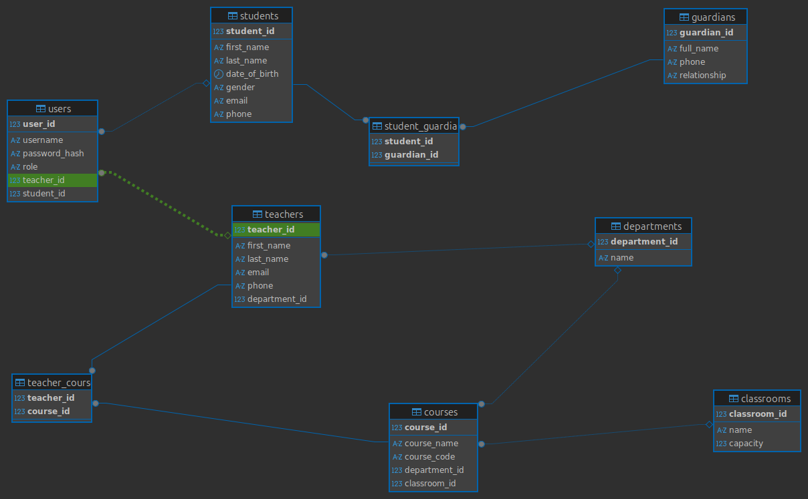

# 🏫 School Management System (MySQL)

## 📋 Description
A normalized SQL database system that manages student, staff, course, and academic records in a school. This system follows best practices in database design, ensuring efficient, consistent, and scalable data handling.

---

## ⚙️ Setup Instructions

1. Clone the repo.
2. Open MySQL Workbench (or preferred SQL tool).
3. Run the `school_management.sql` script.
4. Review the schema and explore the sample data.

---

## 📁 Features

- Manage students, teachers, and guardians.
- Record student enrollment and academic grades.
- Track attendance per course.
- Normalize tables (up to 3NF) to avoid redundancy.
- Relationships: 1-Many, Many-Many, and 1-1.

---

## 🧱 Tables Included

- `students`
- `teachers`
- `courses`
- `classrooms`
- `enrollments`
- `grades`
- `attendance`
- `departments`
- `users`
- `guardians`
- `student_guardian`
- `teacher_course`

---

## 🗺️ ERD

---

## 📂 SQL File

Everything is contained in:

- `school_management.sql` — Main database schema
- (Optional) `school_management2.sql` — Additional or alternative structure

---

## 👤 Author

Evans

---

## 🔐 License

MIT
